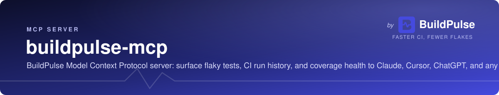

<a href="https://buildpulse.io"></a>

<a href="https://buildpulse.io/mcp?ref=github-badge"></a>

> Model Context Protocol server for the [BuildPulse](https://buildpulse.io)
> Platform API. Surface flaky tests, CI run history, and coverage health
> in Claude Desktop, Cursor, ChatGPT, Cline, Windsurf, Continue, Zed,
> VS Code Copilot, and any other MCP-aware AI agent.

[](https://www.npmjs.com/package/@buildpulse/mcp)
[](https://www.npmjs.com/package/@buildpulse/mcp)
[](./LICENSE)
[](https://registry.modelcontextprotocol.io/v0/servers?search=buildpulse)
[](https://smithery.ai)
[](https://platform.buildpulse.io/docs/mcp)

## Quickstart

Hosted — nothing to install, OAuth sign-in:

```bash
claude mcp add --transport http buildpulse https://mcp.buildpulse.io/mcp
```

Claude.ai or ChatGPT: add a custom connector and paste
`https://mcp.buildpulse.io/mcp`.

Local stdio — any client that spawns a process:

```bash
BUILDPULSE_TOKEN=bp_... npx -y @buildpulse/mcp
```

Get a token at <https://buildpulse.io> → Organization Settings → API
Tokens. Tokens look like `bp_<64 hex chars>`; the older 40-character
hex tokens still work.

## Try asking

- "Why is CI red on `web-client`? Show me the failing tests from the last run."
- "Which tests in `platform-api` have been flakiest this week, and where do they fail?"
- "How well tested is `agents`? Give me flakiness and coverage."
- "Which tests failed in more than one of the last 10 runs of `api`?"
- "Triage the flaky tests in `frontend` and tell me which to quarantine first."

## Install

```bash
npx -y @buildpulse/mcp
```

Or pin globally:

```bash
npm install -g @buildpulse/mcp
```

The package downloads the matching native binary for your platform on
first install. Supported platforms: macOS arm64/x64, Linux arm64/x64,
Windows x64.

## Configure

Every client below reads the same JSON shape; replace `bp_...` with
your token.

### Claude Code

```bash
claude mcp add buildpulse -e BUILDPULSE_TOKEN=bp_... -- npx -y @buildpulse/mcp
```

### Claude Desktop

`~/Library/Application Support/Claude/claude_desktop_config.json`
(macOS) or `%APPDATA%\Claude\claude_desktop_config.json` (Windows):

```json
{
  "mcpServers": {
    "buildpulse": {
      "command": "npx",
      "args": ["-y", "@buildpulse/mcp"],
      "env": { "BUILDPULSE_TOKEN": "bp_..." }
    }
  }
}
```

### Cursor

`.cursor/mcp.json` (per-project) or `~/.cursor/mcp.json` (global):
same JSON shape. Or point Cursor at the hosted server:

```json
{
  "mcpServers": {
    "buildpulse": {
      "url": "https://mcp.buildpulse.io/mcp",
      "headers": { "Authorization": "Bearer bp_..." }
    }
  }
}
```

### VS Code (GitHub Copilot agent mode)

`.vscode/mcp.json`:

```json
{
  "servers": {
    "buildpulse": {
      "type": "http",
      "url": "https://mcp.buildpulse.io/mcp",
      "headers": { "Authorization": "Bearer bp_..." }
    }
  }
}
```

For stdio instead, use `"type": "stdio"` with the `command` / `args` /
`env` fields from the Claude Desktop snippet.

### Windsurf

`~/.codeium/windsurf/mcp_config.json` — same `mcpServers` block as
Claude Desktop.

### Cline

Cline → MCP Servers → Configure → paste the same `mcpServers` block into
`cline_mcp_settings.json`.

### ChatGPT

ChatGPT → Settings → Connectors → Create → URL
`https://mcp.buildpulse.io/mcp`. ChatGPT completes the OAuth sign-in;
no token to paste.

### Other clients

Continue, Zed, and anything else MCP-aware takes the same
`command` / `args` / `env` fields. See the
[install hub](https://platform.buildpulse.io/docs/mcp) for copy-paste
snippets per client.

## Organizations (multi-tenant)

Your BuildPulse token may grant access to more than one organization.
Every repo-scoped tool takes an optional `organization_id` argument (the
org's `id` UUID, discoverable via `list_my_organizations`):

- **Single-org tokens** — omit `organization_id`. It auto-defaults to your
  one organization. Nothing changes; you never need to think about orgs.
- **Multi-org sessions** (`list_my_organizations` returns 2+ orgs) — you
  **must** pass `organization_id` on every repo-scoped call
  (`list_repositories`, `find_flaky_tests`, `get_test_history`,
  `list_recent_submissions`, `get_submission_test_results`,
  `get_recent_failures`, `get_repo_flakiness`, `get_repo_coverage`). The
  org is **not** auto-selected — omitting it returns an error that lists
  every accessible organization and its UUID, so the agent can pick the
  right one and retry. Call `list_my_organizations` first to enumerate
  them.

This avoids silently querying the wrong (often empty) organization and
getting confusingly empty results.

## Tools

| Tool | Purpose |
|------|---------|
| `list_my_organizations` | Enumerate the organizations this token can access; get the `id` (UUID) to pass as `organization_id`. |
| `list_repositories` | List repositories in an organization. |
| `find_flaky_tests` | Search a repository's flaky test inventory; filter by tags, recency, free-text. |
| `get_test_history` | Recent disruption events for a specific test. |
| `list_recent_submissions` | Recent test-result submissions (CI runs) for a repository. |
| `get_submission_test_results` | Per-test results for one submission (one CI run). |
| `get_recent_failures` | Tests that failed across the most recent submissions, aggregated by test identity. |
| `get_repo_flakiness` | Current flakiness % over the last 14 days. `-1` means no recent results. |
| `get_repo_coverage` | Current coverage % from the latest uploaded report. `-1` means no report. |

Repo-scoped tools accept an `organization_id` argument — required for
multi-org sessions, optional (auto-defaulted) for single-org tokens. See
[Organizations](#organizations-multi-tenant) above.

Every output that names a test or repo includes a `web_url` deep-link
back to the BuildPulse web app — the same polish Sentry / Atlassian
use in their MCP responses.

## Prompts

The server also ships four guided prompts (slash-pickable in clients
that support them):

- `/triage_flaky_tests`
- `/ci_health_check`
- `/explain_test_failure`
- `/whats_red`

## Two transports

| Transport | Binary | Where it goes |
|---|---|---|
| **stdio** | [`cmd/mcp`](./cmd/mcp) | npm → `npx -y @buildpulse/mcp` |
| **Streamable HTTP** | [`cmd/mcp-remote`](./cmd/mcp-remote) | hosted at `https://mcp.buildpulse.io/mcp` |

Same tool surface; same prompts; same resources. Pick whichever your
client supports. The stdio path is universal; the hosted variant is
the path to Claude.ai web and ChatGPT, and authenticates with either a
Bearer API token or OAuth 2.1 (PKCE + dynamic client registration;
discovery at `/.well-known/oauth-authorization-server`). The hosted
server also publishes a landing page, `robots.txt`, `sitemap.xml`, and
[`llms.txt`](https://mcp.buildpulse.io/llms.txt) on the bare host.

## Resources

The server exposes two MCP resource templates so agents can pull
state into context without a tool call:

- `buildpulse://repos/{repo}/flaky-tests`
- `buildpulse://repos/{owner}/{name}/submissions`

## Environment variables

| Variable | Required | Default |
|---|---|---|
| `BUILDPULSE_TOKEN` | yes | — |
| `PLATFORM_API_URL` | no | `https://platform.buildpulse.io` |

The **hosted** server (`mcp-remote`) will refuse to start unless
`PLATFORM_API_URL` is production or development Platform API. Local stdio
(`npx @buildpulse/mcp`) is unchanged. See [SECURITY.md](./SECURITY.md) for
the threat model, tenant isolation, P1 rate limits (120 tool calls / token /
minute), the tool audit log, RFC 7009 `/oauth/revoke`, and what we
deliberately do not gate (HITL on reads, hiding tools, killing multi-step
triage).

## Build from source

```bash
git clone https://github.com/BuildPulseLLC/buildpulse-mcp
cd buildpulse-mcp
go build -o ./bin/buildpulse-mcp ./cmd/mcp
go build -o ./bin/buildpulse-mcp-remote ./cmd/mcp-remote
```

Requires Go 1.26+ (see `go.mod`).

## Run tests

```bash
go test -race ./...
```

See [CONTRIBUTING.md](./CONTRIBUTING.md) for the development workflow
and [CHANGELOG.md](./CHANGELOG.md) for release history.

## License

MIT — see [LICENSE](./LICENSE).

## Related

- [BuildPulse Platform API](https://platform.buildpulse.io/docs) — the underlying public REST API
- [@buildpulse/mcp on npm](https://www.npmjs.com/package/@buildpulse/mcp)
- [Distribution strategy](./DISTRIBUTION.md) — Claude, OpenAI, Smithery, Cursor publishing details
- [`/docs/mcp`](https://platform.buildpulse.io/docs/mcp) — branded install hub with copy buttons
- [MCP Registry listing](https://registry.modelcontextprotocol.io/v0/servers?search=buildpulse) — `io.github.BuildPulseLLC/buildpulse-mcp`
